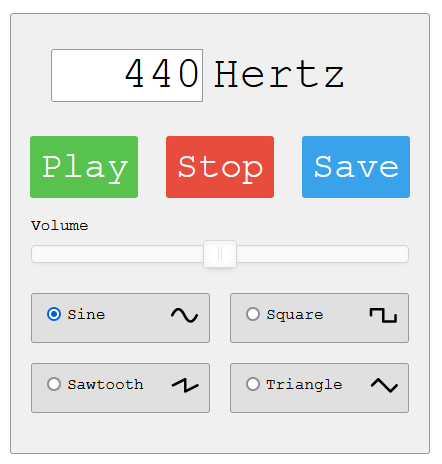

# one-shot with DeepSeek

me:
Create a tone generator using the Web Audio api with javascript, html and css. Use the attached image for the design of gui for the app.


DeepSeekAI:
To create a tone generator using the Web Audio API with JavaScript, HTML, and CSS, we'll follow the design from the attached image. The interface will include controls for frequency, waveform selection, volume, and playback controls (Play, Stop, Save).

Here's a step-by-step guide to building the application:

### HTML (index.html)
```html
<!DOCTYPE html>
<html lang="en">
<head>
    <meta charset="UTF-8">
    <meta name="viewport" content="width=device-width, initial-scale=1.0">
    <title>Tone Generator</title>
    <link rel="stylesheet" href="styles.css">
</head>
<body>
    <div class="container">
        <h1>440 Hertz</h1>
        <div class="controls">
            <button id="play">Play</button>
            <button id="stop">Stop</button>
            <button id="save">Save</button>
        </div>
        <div class="volume-control">
            <label for="volume">Volume</label>
            <input type="range" id="volume" min="0" max="1" step="0.01" value="0.5">
        </div>
        <div class="waveform-control">
            <label><input type="radio" name="waveform" value="sine" checked> Sine</label>
            <label><input type="radio" name="waveform" value="square"> Square</label>
            <label><input type="radio" name="waveform" value="sawtooth"> Sawtooth</label>
            <label><input type="radio" name="waveform" value="triangle"> Triangle</label>
        </div>
    </div>
    <script src="script.js"></script>
</body>
</html>
```

### CSS (styles.css)
```css
body {
    font-family: Arial, sans-serif;
    display: flex;
    justify-content: center;
    align-items: center;
    height: 100vh;
    margin: 0;
    background-color: #f0f0f0;
}

.container {
    text-align: center;
    background-color: #fff;
    padding: 20px;
    border-radius: 10px;
    box-shadow: 0 0 10px rgba(0, 0, 0, 0.1);
}

.controls {
    margin: 20px 0;
}

.controls button {
    padding: 10px 20px;
    margin: 5px;
    font-size: 16px;
}

.volume-control {
    margin: 20px 0;
}

.waveform-control {
    margin: 20px 0;
}

.waveform-control label {
    margin: 0 10px;
    font-size: 16px;
}
```

### JavaScript (script.js)
```javascript
document.addEventListener('DOMContentLoaded', function() {
    const audioContext = new (window.AudioContext || window.webkitAudioContext)();
    let oscillator;
    let isPlaying = false;

    const playButton = document.getElementById('play');
    const stopButton = document.getElementById('stop');
    const saveButton = document.getElementById('save');
    const volumeControl = document.getElementById('volume');
    const waveformControls = document.querySelectorAll('input[name="waveform"]');

    playButton.addEventListener('click', function() {
        if (!isPlaying) {
            oscillator = audioContext.createOscillator();
            oscillator.type = document.querySelector('input[name="waveform"]:checked').value;
            oscillator.frequency.setValueAtTime(440, audioContext.currentTime); // 440 Hz
            const gainNode = audioContext.createGain();
            gainNode.gain.setValueAtTime(volumeControl.value, audioContext.currentTime);

            oscillator.connect(gainNode);
            gainNode.connect(audioContext.destination);

            oscillator.start();
            isPlaying = true;
            playButton.textContent = 'Pause';
        } else {
            oscillator.stop();
            isPlaying = false;
            playButton.textContent = 'Play';
        }
    });

    stopButton.addEventListener('click', function() {
        if (oscillator) {
            oscillator.stop();
            isPlaying = false;
            playButton.textContent = 'Play';
        }
    });

    volumeControl.addEventListener('input', function() {
        if (oscillator) {
            const gainNode = audioContext.createGain();
            gainNode.gain.setValueAtTime(volumeControl.value, audioContext.currentTime);
            oscillator.connect(gainNode);
            gainNode.connect(audioContext.destination);
        }
    });

    waveformControls.forEach(control => {
        control.addEventListener('change', function() {
            if (oscillator) {
                oscillator.type = this.value;
            }
        });
    });

    saveButton.addEventListener('click', function() {
        // Implement save functionality if needed
        console.log('Save functionality not implemented yet.');
    });
});
```

### Explanation
- **HTML**: The structure includes a container with controls for frequency, waveform selection, volume, and playback.
- **CSS**: Basic styling to center the interface and make it visually appealing.
- **JavaScript**: Uses the Web Audio API to create and control an oscillator. The oscillator's type and frequency are set based on user input. The volume is controlled using a gain node.

This code provides a basic tone generator with a simple GUI. You can expand it by adding more features like frequency adjustment or saving the generated tone as an audio file.


me:
ok that's a great start. 
Please add a slider to change the frequency in real-time. This slider will appear above the "volume" slider.
 When the slider changes the Value in the Hertz display will change to show the updated frequency

DeepSeekAI:

To add a frequency slider that updates the displayed frequency in real-time, we'll modify the existing code. Here's how we can do it:

### Updated HTML (index.html)
```html
<!DOCTYPE html>
<html lang="en">
<head>
    <meta charset="UTF-8">
    <meta name="viewport" content="width=device-width, initial-scale=1.0">
    <title>Tone Generator</title>
    <link rel="stylesheet" href="styles.css">
</head>
<body>
    <div class="container">
        <h1 id="frequencyDisplay">440 Hertz</h1>
        <div class="controls">
            <button id="play">Play</button>
            <button id="stop">Stop</button>
            <button id="save">Save</button>
        </div>
        <div class="frequency-control">
            <label for="frequency">Frequency</label>
            <input type="range" id="frequency" min="20" max="2000" step="1" value="440">
        </div>
        <div class="volume-control">
            <label for="volume">Volume</label>
            <input type="range" id="volume" min="0" max="1" step="0.01" value="0.5">
        </div>
        <div class="waveform-control">
            <label><input type="radio" name="waveform" value="sine" checked> Sine</label>
            <label><input type="radio" name="waveform" value="square"> Square</label>
            <label><input type="radio" name="waveform" value="sawtooth"> Sawtooth</label>
            <label><input type="radio" name="waveform" value="triangle"> Triangle</label>
        </div>
    </div>
    <script src="script.js"></script>
</body>
</html>
```

### Updated CSS (styles.css)
```css
body {
    font-family: Arial, sans-serif;
    display: flex;
    justify-content: center;
    align-items: center;
    height: 100vh;
    margin: 0;
    background-color: #f0f0f0;
}

.container {
    text-align: center;
    background-color: #fff;
    padding: 20px;
    border-radius: 10px;
    box-shadow: 0 0 10px rgba(0, 0, 0, 0.1);
}

.controls {
    margin: 20px 0;
}

.controls button {
    padding: 10px 20px;
    margin: 5px;
    font-size: 16px;
}

.frequency-control, .volume-control {
    margin: 20px 0;
}

.waveform-control {
    margin: 20px 0;
}

.waveform-control label {
    margin: 0 10px;
    font-size: 16px;
}
```

### Updated JavaScript (script.js)
```javascript
document.addEventListener('DOMContentLoaded', function() {
    const audioContext = new (window.AudioContext || window.webkitAudioContext)();
    let oscillator;
    let isPlaying = false;

    const playButton = document.getElementById('play');
    const stopButton = document.getElementById('stop');
    const saveButton = document.getElementById('save');
    const volumeControl = document.getElementById('volume');
    const frequencyControl = document.getElementById('frequency');
    const frequencyDisplay = document.getElementById('frequencyDisplay');
    const waveformControls = document.querySelectorAll('input[name="waveform"]');

    playButton.addEventListener('click', function() {
        if (!isPlaying) {
            oscillator = audioContext.createOscillator();
            oscillator.type = document.querySelector('input[name="waveform"]:checked').value;
            oscillator.frequency.setValueAtTime(frequencyControl.value, audioContext.currentTime);
            const gainNode = audioContext.createGain();
            gainNode.gain.setValueAtTime(volumeControl.value, audioContext.currentTime);

            oscillator.connect(gainNode);
            gainNode.connect(audioContext.destination);

            oscillator.start();
            isPlaying = true;
            playButton.textContent = 'Pause';
        } else {
            oscillator.stop();
            isPlaying = false;
            playButton.textContent = 'Play';
        }
    });

    stopButton.addEventListener('click', function() {
        if (oscillator) {
            oscillator.stop();
            isPlaying = false;
            playButton.textContent = 'Play';
        }
    });

    volumeControl.addEventListener('input', function() {
        if (oscillator) {
            const gainNode = audioContext.createGain();
            gainNode.gain.setValueAtTime(volumeControl.value, audioContext.currentTime);
            oscillator.connect(gainNode);
            gainNode.connect(audioContext.destination);
        }
    });

    frequencyControl.addEventListener('input', function() {
        const frequency = frequencyControl.value;
        frequencyDisplay.textContent = `${frequency} Hertz`;
        if (oscillator) {
            oscillator.frequency.setValueAtTime(frequency, audioContext.currentTime);
        }
    });

    waveformControls.forEach(control => {
        control.addEventListener('change', function() {
            if (oscillator) {
                oscillator.type = this.value;
            }
        });
    });

    saveButton.addEventListener('click', function() {
        // Implement save functionality if needed
        console.log('Save functionality not implemented yet.');
    });
});
```

### Explanation
- **HTML**: Added a new slider for frequency control and updated the frequency display to show the current frequency.
- **CSS**: Added styling for the new frequency control slider.
- **JavaScript**: Added an event listener for the frequency slider to update the displayed frequency and the oscillator's frequency in real-time.

This update allows users to adjust the frequency of the generated tone dynamically, with the frequency value displayed above the slider.